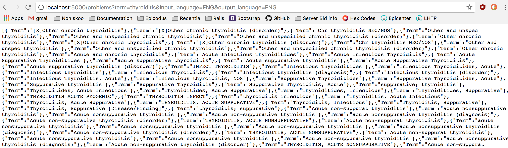
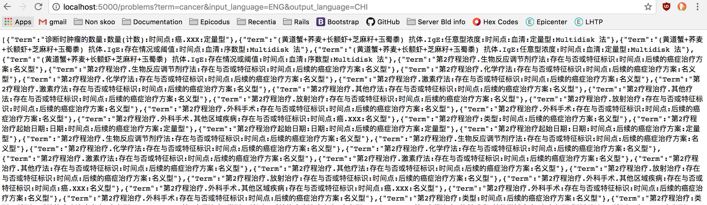
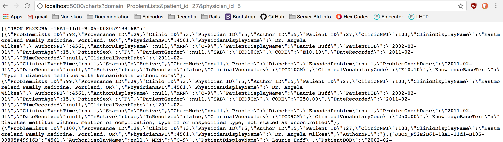

# RHapi API

An example of an API returning custom stored procedures from Recentia Health database.

## Installation
* `$ git clone https://github.com/sushadore/RHapi`
* `$ cd RHapi`
* Open file with text editor.

## Paths
The following endpoints function when connected to the database which is proprietary and not available for public use. The screen shots show examples of browser rendering. For both endpoints if a required parameter is not listed, a value or any of the records do not exist or capitalizations is not correct, an empty array is returned. Links are endpoint format examples but as the app is not connected to the database, __they are non functional__.
* Problem: http://localhost:5000/problems?term=thyroiditis&input_language=ENG&output_language=ENG

Replace "thyroiditis" and "ENG" with the desired values to customize search. term, input_language & output_language are required parameters.

* Chart:
http://localhost:5000/charts?domain=ProblemLists&patient_id=1&physician_id=1
Replace "ProblemsList" & "1" with desired values to customize search. domain, patient_id and physician_id are required parameters. All data is sample data thus actual patient records are not stored, accessed, or displayed.

## Technologies Used
* [Ruby](https://www.ruby-lang.org/en/downloads/)
* [Rails](http://rubyonrails.org/)
* [Tiny TDS](https://github.com/rails-sqlhserver/tiny_tds)
* [ActiveRecord SQLServer Adapter](https://github.com/rails-sqlserver/activerecord-sqlserver-adapter)

#### Authors
Jin Camou, Susha Dore, Ben Williams
